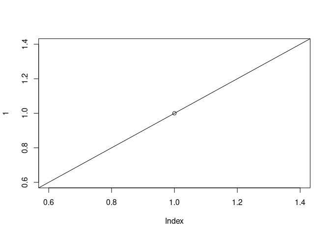

## Index

* [Description](#description)
* [Features](#features)
* [Installation](#installation)


## Description

**arpproj2** is a test second project. 

This app has several functions:

* including at least one that uses other packages,
* at least one data set (can be synthetic),
* proper documentation of the functions and the data set should be included.

## Features

* Easy to use.
* Good documentation.


This is a link to [Google](https://google.pl).


```r
plot(cars)
```

<!-- -->


```r
plot(1)         # high-level plot
abline(0, 1)    # low-level change
```

<!-- -->

```r
plot(rnorm(10)) # high-level plot
# many low-level changes in a loop (a single R expression)
for(i in 1:10) {
    abline(v = i, lty = 2)
}
```

<!-- -->

| Syntax      | Description | Test Text     |
| :---        |    :----:   |          ---: |
| Header      | Title       | Here's this   |
| Paragraph   | Text        | And more      |


```r
cat("I'm raw **Markdown** content.\n")
```

I'm raw **Markdown** content.
